# Pardus Servis Yönetim Aracı

Bu proje, Linux Araçları ve Kabuk Programlama dersi dönem projesi kapsamında geliştirilmiştir. Projenin amacı, Pardus işletim sistemi üzerinde çalışan sistem servislerinin (systemd) yönetimini kolaylaştırmak için kullanıcı dostu arayüzler sunmaktır.

Proje kapsamında, terminal komutlarına ihtiyaç duymadan servisleri yönetebilmek için iki farklı arayüz geliştirilmiştir:
1. Grafiksel Kullanıcı Arayüzü (GUI)
2. Terminal Tabanlı Arayüz (TUI)

## Proje Özellikleri

Geliştirilen araç aşağıdaki temel fonksiyonları yerine getirmektedir:

* **Servis Listeleme:** Sistemde kayıtlı olan servislerin adını, aktiflik durumunu ve çalışma durumunu listeler.
* **Servis Başlatma (Start):** Seçilen veya adı girilen bir servisi başlatır.
* **Servis Durdurma (Stop):** Çalışmakta olan bir servisi durdurur.
* **Durum Sorgulama (Status):** Bir servisin detaylı durum bilgisini (çalışma süresi, PID, bellek kullanımı vb.) gösterir.
* **Log Görüntüle (Journal):** Seçilen servise ait son sistem kayıtlarını (logları) gösterir.
* **Yetki Kontrolü:** Sistem güvenliği için programın sadece yetkili kullanıcı (root) tarafından çalıştırılmasına izin verir.

## Gerekli Araçlar ve Kütüphaneler

Projenin çalışabilmesi için sistemde aşağıdaki paketlerin yüklü olması gerekmektedir:

* **YAD (Yet Another Dialog):** Grafik arayüz pencereleri için.
* **Whiptail:** Terminal arayüz menüleri için.
* **Systemd & Journalctl:** Servis yönetimi ve log okuma işlemleri için (Pardus üzerinde varsayılan olarak gelir).
* **Bash:** Scriptlerin yorumlanması için.

## Kurulum

Projeyi bilgisayarınıza kurmak ve gerekli bağımlılıkları yüklemek için terminalde aşağıdaki adımları izleyin:

1. Gerekli paketleri yükleyin:
sudo apt update
sudo apt install yad git

2. Projeyi GitHub üzerinden indirin:
git clone https://github.com/selinsenturkk/pardus-servis-yoneticisi.git

3. Proje dizinine girin:
cd pardus-servis-yoneticisi/LinuxProje

4. Script dosyalarına çalıştırma izni verin:
chmod +x gui_app.sh tui_app.sh

## Kullanım

Program, sistem servislerine müdahale ettiği için "sudo" komutu ile yönetici yetkisi kullanılarak çalıştırılmalıdır.    

*Örneğin Terminal Arayüzü 'sudo' komutu ile çalıştırılmadığında.*  

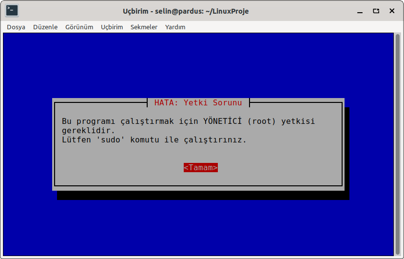  

**Grafik Arayüzü (GUI) Çalıştırmak İçin:**
Aşağıdaki komut, YAD tabanlı pencereli arayüzü başlatır:
sudo ./gui_app.sh

**Terminal Arayüzü (TUI) Çalıştırmak İçin:**
Aşağıdaki komut, Whiptail tabanlı terminal içi menü arayüzünü başlatır:
sudo ./tui_app.sh

## Grafiksel Kullanıcı Arayüzü (GUI)

Projenin bu modülü, `YAD` (Yet Another Dialog) aracı kullanılarak geliştirilmiştir. Kullanıcılara modern bir pencere deneyimi sunar, fare ile kontrol edilebilir ve işlem çıktılarını okunabilir pencerelerde gösterir. Görsel masaüstü ortamlarında kullanım için idealdir.

### Ekran Görüntüleri

*Şekil 1: Program başlatıldığında kullanıcının karşılaştığı ana işlem menüsü*
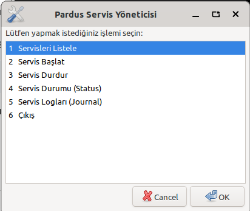

*Şekil 2: Sistemdeki servislerin anlık durumlarını (aktif/pasif) ve çalışma bilgilerini (running/dead) düzenli bir liste halinde gösteren ekran*  
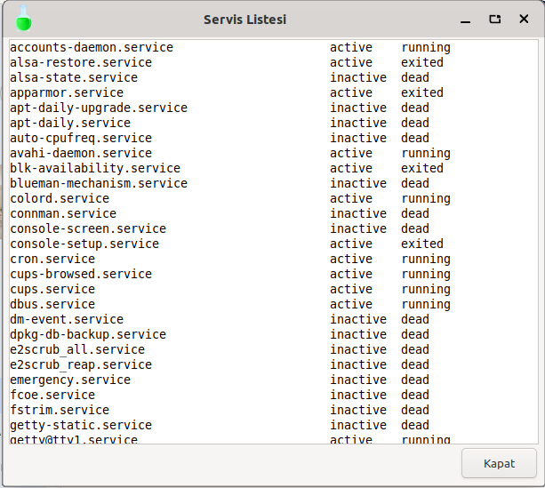

*Şekil 3: Kullanıcıdan, başlatılmak istenen servisin adının (örn: cron, ssh) istendiği giriş penceresi*
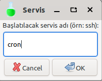

*Şekil 4: Servis başlatma işlemi sorunsuz tamamlandığında kullanıcıya geri bildirim veren onay penceresi*
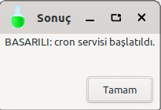

*Şekil 5: Çalışmakta olan bir servisi durdurmak için servis adının girildiği işlem penceresi*
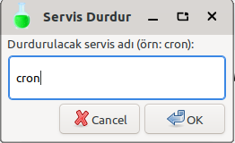

*Şekil 6: Servis durdurma komutu systemctl üzerinden başarıyla iletildiğinde görüntülenen bilgi mesajı*
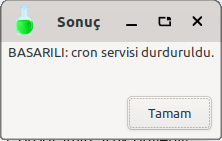

*Şekil 7: Seçilen servisin çalışma süresi, PID numarası, bellek kullanımı ve son durum loglarını içeren detaylı bilgi ekranı. (Ekranda cron servisinin servis durumu görünmektedir.)*  
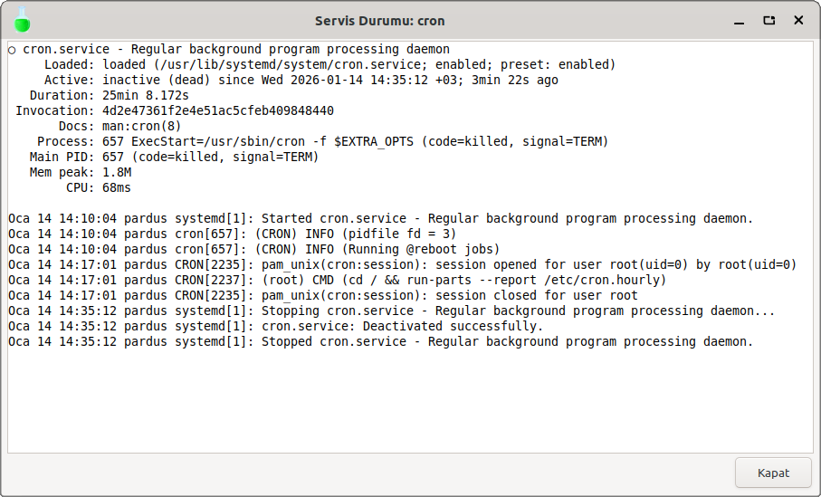

*Şekil 8: journalctl entegrasyonu sayesinde, ilgili servise ait geçmiş sistem kayıtlarının (logların) döküldüğü pencere. (Ekranda cron servisinin logları görülmektedir.*  
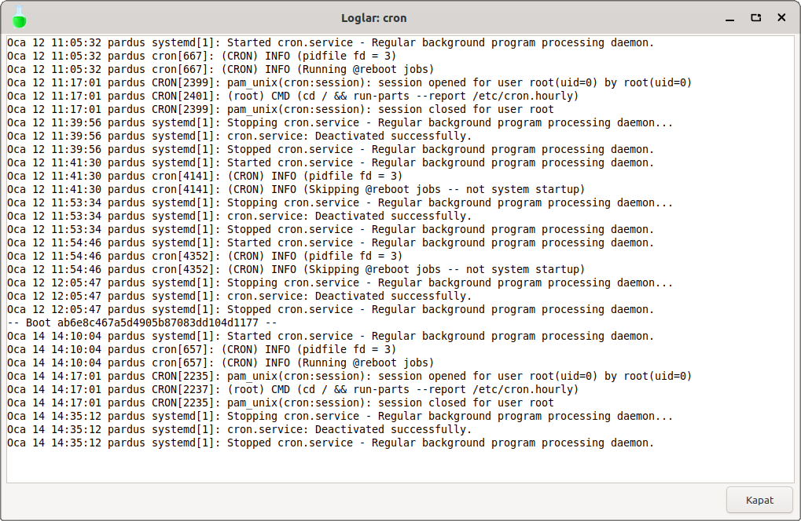

---

## Terminal Tabanlı Arayüz (TUI)

Projenin bu modülü, `Whiptail` aracı kullanılarak geliştirilmiştir. Grafik arayüzün bulunmadığı sunucu ortamlarında (headless server) veya doğrudan terminal üzerinden hızlı işlem yapılmak istendiğinde kullanılır. Klavye yön tuşları ile tam kontrol sağlar.

### Ekran Görüntüleri

*Programın başlangıç ekranı; kullanıcı yön tuşları ile menüde gezinerek işlem seçimi yapabilir.*
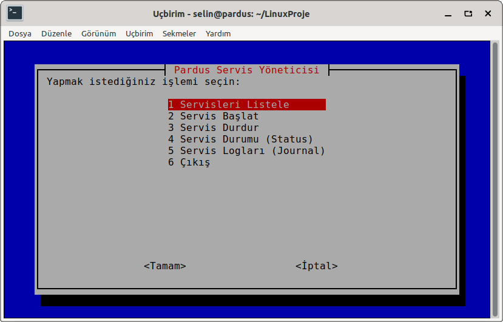

*Sistemde kayıtlı servislerin aktiflik ve çalışma durumlarının listelendiği bilgi ekranı.*
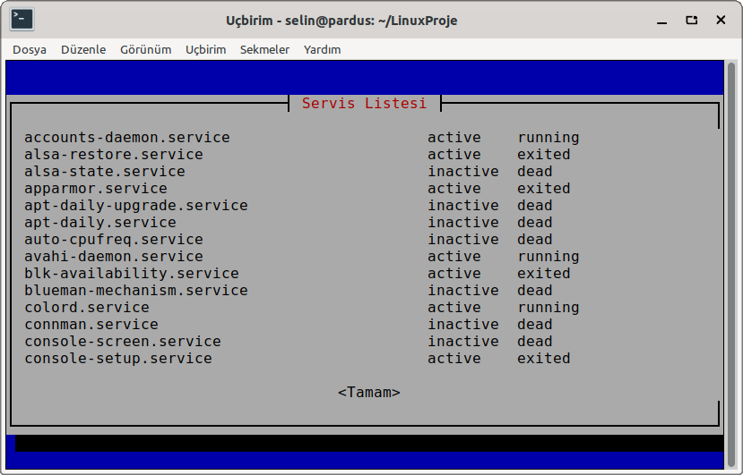

*Başlatılmak istenen servisin adının girildiği terminal tabanlı giriş kutusu.*
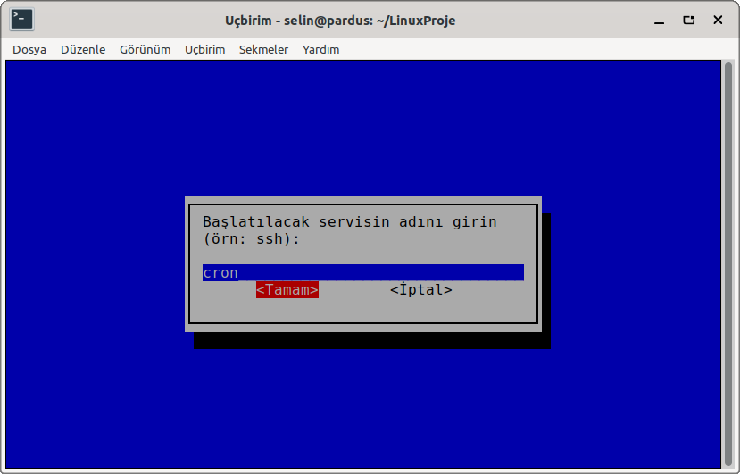

*Servis başlatma komutu başarıyla uygulandığında kullanıcıya gösterilen onay mesajı.*

*Durdurulacak servisin adının istendiği giriş ekranı.*
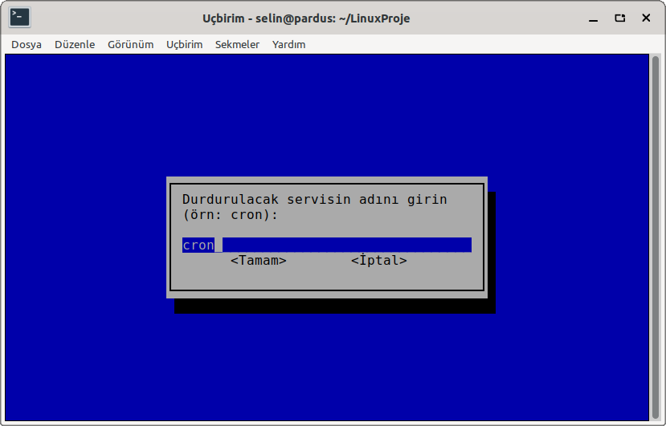

*Servis durdurma işleminin sorunsuz tamamlandığını bildiren bilgi penceresi.*
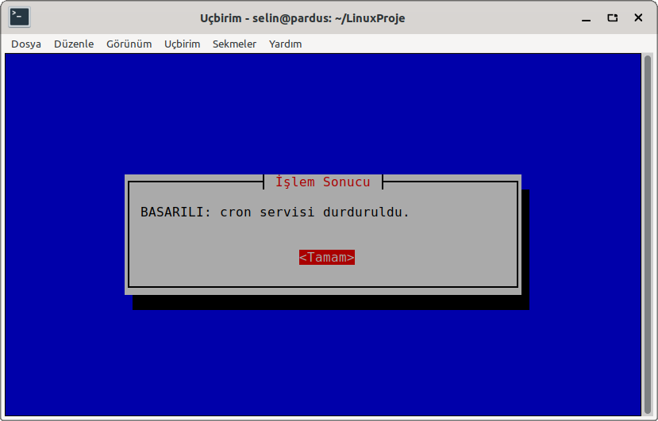

*Servisin çalışma süresi, PID, bellek kullanımı ve işlem ağacı gibi teknik detayların sunulduğu durum ekranı. (Ekranda cron servisi için durum ekranı gösterilmektedir.)*
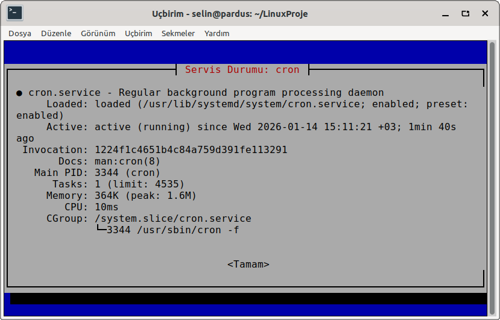

*Seçilen servise ait `journalctl` kayıtlarının (logların) terminal üzerinde görüntülendiği pencere. (Ekranda cron servisinin logları görünmektedir.)*
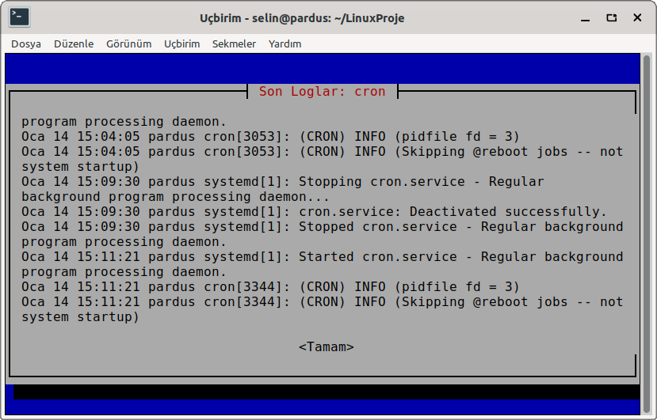

## Proje Videosu

Projenin kurulumu, tanıtımı ve örnek kullanım senaryolarını içeren videoya buradan ulaşabilirsiniz:
